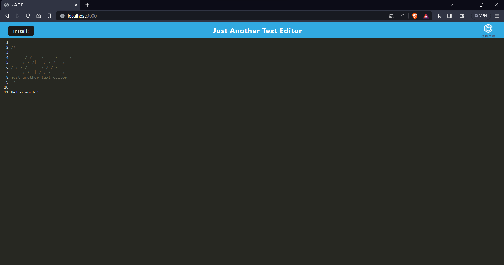

# Text-Editor

## Description

This is a text editor that can be used online and offline. When the user enters text, the data is stored automatically and will persist. The user is able to download the application for offline use.

Access the application here: https://danhalsim-text-editor-08dc2f937961.herokuapp.com/

A screenshot of the application running:

## Table of Contents

- [Installation](#installation)
- [Usage](#usage)
- [Credits](#credits)
- [License](#license)
- [Contributions](#contributions)
- [Tests](#Tests)
- [Questions](#Questions)

## Installation

Open the application using the link above. Click on `install` to use the application offline.

## Usage

Enter your notes into the text field.

## Credits

- UCI BCS for the starter code and the application description.
- AskBCS for help with debugging.
- Xpert Learning Assistant for help with:
    - database.js (16-27, 30-42)
    - install.js (18-30)
    - src-sw.js (32-44)

## License

This project uses the MIT License.

https://opensource.org/licenses/MIT 

## Contributions

N/A

## Tests

N/A

## Questions

If you have any questions about the project, please reach out!

Github: https://github.com/danhalsim

Email: dansim6935@gmail.com